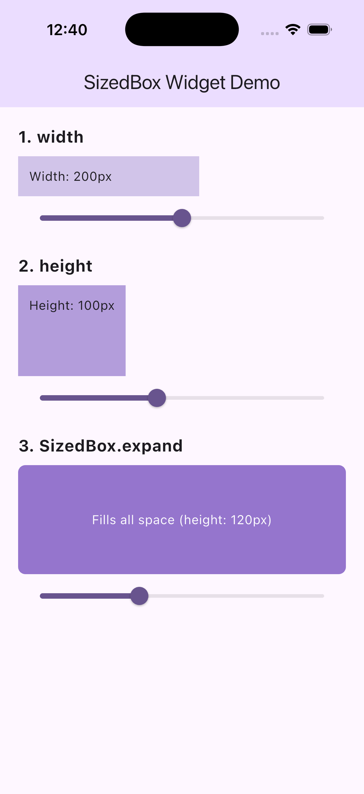

# SizedBox Widget Demo — Flutter Presentation

`SizedBox` is a Flutter layout widget that forces its child to have a specific width, height, or both — giving you precise dimensional control over any widget in your UI.

[Demo Slide](https://www.canva.com/design/DAHAWuePAAM/FWDcyKemG_to9TWrZulw7w/view?utm_content=DAHAWuePAAM&utm_campaign=designshare&utm_medium=link2&utm_source=uniquelinks&utlId=h76e2ed4f8a)

## Run Instructions

```bash
# 1. Install dependencies
flutter pub get

# 2. Run on your preferred device
flutter run
```

## Three Attributes Demonstrated

| # | Property / Constructor | Default | What It Does |
|---|------------------------|---------|-------------|
| 1 | **`width`** | `null` (unconstrained) | Sets the exact horizontal size of the box. Useful for giving a widget a fixed width regardless of its content. |
| 2 | **`height`** | `null` (unconstrained) | Sets the exact vertical size of the box. Commonly used to add fixed vertical spacing between widgets or constrain a widget's height. |
| 3 | **`SizedBox.expand`** | `width: ∞, height: ∞` | A named constructor that sets both dimensions to `double.infinity`, causing the child to fill all available space in its parent. Great for making buttons or containers stretch to full width. |

## Screenshot


